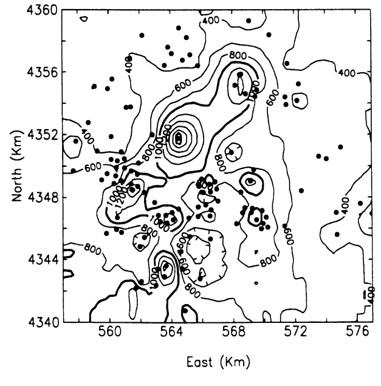

```{r setup, include=FALSE}
knitr::opts_chunk$set(echo = TRUE)

```

***Inicialización de librerias***

```{r require.libs, include=FALSE}
if(!require(pacman)) install.packages("pacman")
pacman::p_load(
    'automap',
    'dplyr',
    'geoR',
    'ggplot2',
    'ggpubr',
    'gstat',
    'spdep',
    'sp',
    'automap',
    'rgdal',
    'udunit2'
)

load(file = "./data/spain_geodata_temperature_1989_spring.RData")

```

Para este trabajo tenemos un grupo grande de librerias a utilizar. Vamos a separar por su
funcionalidad.

```{r init, warning=FALSE, message=FALSE}
## librerias básicas
library(dplyr)
library(ggplot2)
library(ggpubr)
library(readr)
library(reshape2)

## Librerias de geo estadística
library(automap)
library(geoR)
library(gstat)
library(raster)
library(rgdal)
library(sp)
library(spdep)


## Librerias auxiliares
library(automap)
library(FNN)
library(lattice)
library(udunits2)
library(viridis)

```


# Descripción del dataset y procesamiento de datos

Los datos originales surgen de la reconstrucción de la serie de tiempo de datos de 
temperatura para Europa desde el año 1500 al 2002. El dataset contiene una grilla que cubren
el area espacial desde latitud 30°N hasta 70°N y longitud 25°O hasta los 40°E. A su vez, 
los años están dividos en 
estaciones, siendo cuatro grillas por cada año. Los datos provienen de 
*Luterbacher, J., Dietrich, D., Xoplaki, E., Grosjean, M., and Wanner, H., 2004(DOI:10.1126/science.1093877)* 
y 
*Xoplaki, E., Luterbacher, J., Paeth, H., Dietrich, D., Steiner N., Grosjean, M., and Wanner, H., 2005(DOI:10.1029/2005GL023424))*.

Para nuestro problema en particular, decidimos tomar la primavera de 1989 y circunscribir 
el análisis a la región que pertenece a España. Recortamos el mapa en la latitud 35.61°N a
43.99°N longitud 10.69°O a 4.48°E. Es importante aclarar que solamente los puntos de 
tierra tienen datos de temperatura, mientras lo que están en el oceano son tipo NULL.  

## Preprocesamiento de los datos

Inicialmente estos datos se tomó el dataset de los papers citados previamente, el mismo 
consiste en un archivo GDX que tiene contiene por linea 9100 puntos de temperatura
correspondientes a una grilla de 0.5 x 0.5 con la siguiente configuración:

>File: TT_Europe_Seasons_1500_2002.New.GDX
>
>Grid: 0.5° x 0.5°
>
>Spatial area: 25W - 40E und 30 - 70N
>
>Note: the date are valied for a 0.5x0.5deg box. The center of the box is
>always on a xx.25 coordinate	
>
>Time period: Winter 1500 - Autumn 2002 

```{r, echo = F, fig.align = 'center', fig.cap = 'Datos originales.', out.width='100%'}

```

Cómo se mencionó antes, se decidió tomar la primavera de 1989 para poder eliminar la
componente temporal de nuestro proceso estocástico y centrarnos solo en el análisis 
espacial. Para poder realizar este filtrado, primero debemos entender la naturaleza de los
datos, el formato de los datos obtenidos es de una grilla que se obtuvo de aplicar una 
proyección Equirectangular sobre el área cubierta mencionada anteriormente. Cada linea
en el archivo GDX original representa una estación del año y el correspondiente año, donde
vamos a encontrar el primer punto corresponde a las coordenadas (-25,70), luego (-24.5,70)
etc, llenandose por longitudes desde la latitud más alta hasta la más baja. 

Con esto, sabiendo la densidad de la grilla podemos convertir el vector de 9100 puntos en
una matriz (grilla) de 70x130. Estos datos primeramente segmentados los vamos a convertir
en un archivo csv que luego podamos ingestar en R para su posterior procesamiento.

Una vez disponibilizado el archivo csv para la primavera de 1989, filtramos incialmente los
valores _NaN_, dado que por construcción el dataset original tiene los cuerpos de agua con
una referencia de _NaN_ o -999.99, ya que éste valor no tiene información alguna a nuestro
análisis los retiramos. Luego de ello vamos a filtrar el área correspondiente para la 
segmentación del territorio Español. 

> Spain Boundary box
> 
> Lon: -10.59, 4.48
>
> Lat: 35.61, 43.99

Dado que esta grilla contiene puntos referentes a otros paises se realizó un proceso de 
limpieza más exhaustivo para que los puntos del dataset estén contenidos dentro del 
contorno del país. Para esto utilizamos un _shp_ de españa e iterativamente se fueron
removiendo los puntos externos al pais.

```{r, echo = F, fig.align='center', fig.cap='Representación de los datos en el dataset', out.width='140%'}

```

Finalmente, dado que este dataset es un dato tipo arial, realizamos una adaptación para
poder utilizar las técnicas vistas en clase. Para ello retiramos aleatoriamente puntos
dentro de la grilla. Esto nos da una suerte de datasets de train y test para validar 
nuestras regresiones. 

```{r, echo = F, fig.align='center', fig.cap='Separación de los datos', out.width='140%'}

```

A fines de reproducibilidad, se eligió la semilla 42 en la segmentación de datos aleatoria,
el dataset de training cuenta con el 70% del contenido del dataset inicial, dando una cuenta
total de 163 puntos, mientras que los de test tienen 70 puntos.

Estos datos finalmente fueron guardados como _Data.Frame_ y como _GeoData.Data.Frame_ para
poder ser analizado posteriormente.

En las siguientes secciones se analizará a partir de los datos de _training_ y se 
interpolara mediante el método de _kriging_ sobre los datos de _testing_ para poder validar
los resultados.


```{r s2.overall, include=FALSE}

#Tanto para Moran cómo para Geary
sp_geo_data <- as.geodata(cbind(sp_data_final$longitude,sp_data_final$latitude,sp_data_final$temp))
pixel <- coordinates(sp_geo_data[1])
grilla <- dnearneigh(pixel,0,3)
plot(grilla ,pixel)
pesos <- nb2listw(grilla, style = "W")

#Con Geary y Moran se rechaza la hipótesis nula, hay dependencia espacial
moran_test <- moran.test(sp_geo_data$data, nb2listw(grilla, style = "W"),randomisation=FALSE)
geary_test <- geary.test(sp_geo_data$data, nb2listw(grilla, style = "W"),randomisation=FALSE)

try_dist <- seq(1.5,8,0.25)
stat_moran <- NULL
stat_geary <- NULL

for (i in try_dist){
    grilla <- dnearneigh(pixel,0,i)
    pesos <- nb2listw(grilla, style = "W")
    moran_test_try <- moran.test(sp_geo_data$data, nb2listw(grilla, style = "W"),randomisation=FALSE)
    geary_test_try <- geary.test(sp_geo_data$data, nb2listw(grilla, style = "W"),randomisation=FALSE)
    stat_moran <- append(stat_moran, moran_test_try$statistic)
    stat_geary <- append(stat_geary, geary_test_try$statistic)
}

dat_gg_mg <- data.frame(try_dist, stat_moran, stat_geary)

g1 = ggplot(dat_gg_mg) +
    geom_line(aes(x = try_dist, y = stat_moran),size = 1, col = "turquoise3") +
    geom_line(aes(x = try_dist, y = stat_geary), size = 1, col = "orange") +
    geom_hline(yintercept = 20, colour = "purple") +
    ylab("Estadístico") +
    xlab("Máxima distancia de vecinos")+
    theme(legend.position = "bottom", legend.justification = c("right", "top"))

grilla1 <- dnearneigh(pixel,0,2)
grilla2 <- dnearneigh(pixel,0,6)

```

# Analísis iniciales

## Descripción del problema y autocorrelación

En un problema de estadística espacial nos interesa estudiar la varianza-covarianza de la
varible en estudio en el espacio. Es decir, determinar si la variable regionalizada tiene
un comportamiento que se pueda modelar en función a su ubicación en el espacio. Para este
motivo, vamos a medir la autocorrelación espacial mediante el *Índice de Moran* y el
*Estadístico C de Geary* que miden la autocorrelación lineal de los datos.  

Mientras el *Índice de Moran* muestra la similaridad entre puntos cercanos, y cuyo peso
dentro del índice disminuye conforme los puntos están alejados, el *Estadístico C de Geary*
mide la autocorrelación dando lugar a un rango de valores que va de 0 a 2, dónde el valor
1 implica la ausencia de correlación espacial y en los extremos se encuentran la
correlación positiva y negativa, respectivamente. 

$$
\text{Indice Moran} = \frac{n}{(n-1)W_0S^2} \sum_{i=1}^{n} \sum_{j=1}^{n} w_{ij}(z(s_i)- \bar{z})(z(s_j)- \bar{z})
$$
$$
\text{Estadístico }C\text{ Geary}  = \frac{1}{2W_0S^2} \sum_{i=1}^{n} \sum_{j=1}^{n} w_{ij}((z(s_i)-z(s_j))^2)
$$
En una primera aproximación, tanto el *Índice de Moran* cómo el *Estadístico C de Geary* 
son significativos con los siguientes p-valores `r moran_test$p.value` y `r geary_test$p.value`, 
respectivamente con una distancia máxima de 3° para definir la cantidad de vecinos.
Ahora bien, para dar una idea de la sensibilidad del parámetro con una distancia máxima
de 2° se consiguen 25 vecinos en promedio por punto, mientras que extendiendo esa distancia
máxima a 6° se consiguen 126 vecinos en promedio. 

```{r, echo=FALSE, fig.cap = "variabilidad según nivel de vecinos", fig.align='center'}
par(mfrow=c(1,2))
plot(grilla1 ,pixel)
plot(grilla2 ,pixel,col=alpha("red",0.9))
```

### Estabilidad de los estadísticos según distancia máxima de vecinos

Para asegurarnos de que los estadísticos sean significativos dentro de un rango aceptable
de distancia entre vecinos corrimos los test distintas cantidades de vecinos. Es una
secuencia que va desde 1.5° de distancia máxima hasta 8°, y se puede ver que tanto Moran
cómo Geary se vuelven más significativos hasta una distancia máxima de 3° para descender
con una pendiente cada vez menos pronunciada hasta los 8° de distancia máxima. Por eso
entendemos que los estadísticos parecerían tener cierta estabilidad en el rango que va de 2° a 4° de distancia máxima. 

```{r, echo=FALSE, fig.cap = 'Estadísticos de Moran y Geary según distancia de vecinos', fig.align='center'}
g1
```

## Índice de Moran Local y detección de puntos atípicos

En el caso del problema provisto de temperaturas, el estadístico C de Geary con `r geary_test$estimate[1]`
nos está hablando de una correlación positiva. Es decir, a puntos de alta temperatura le 
corresponden puntos de alta temperatura a su alrededor, y lo mismo se espera con puntos de
baja temperatura o temperatura media. Con el procedimiento de Moran Local procederemos a 
ver cuáles son los puntos atípicos cuya disimilaridad es sigficativa. 

$$IML_{Si} = \frac{z(Si)- \bar{z}}{S^2} \sum_{j=1 j \neq i}^{n}w_{ij}(z(s_j)- \bar{z})$$

```{r, echo=TRUE, fig.cap = 'Gráfico de dispersión de Moran para nuestros datos', fig.align='center'}
M <- moran.plot(sp_geo_data$data,
              pesos,
              zero.policy = F,
              col = 3,
              quiet = T, 
              labels = T,
              xlab = "Temperatura",
              ylab = "lag(Temperatura)")
```


```{r s2.moran.p2, warning = F, rows.print = 20, layout="l-body-outset"}
ML <- localmoran(sp_geo_data$data, pesos, alternative ="less")
IML <- data.frame(ML)

names(IML) <- c('Ii', 'E.Ii', 'Var.Ii', 'Z.Ii', 'Prob')

IML %>% arrange( Prob, Z.Ii )

```

Eliminamos los desvíos negativos cuyo p-valor es menor al 0.05. De esta manera limpiamos a
los datos de los valores atípicos con mayor disimilaridad. 

```{r s2.moran.p3, echo=TRUE}
neg_Moran_Local <- subset(IML, Prob < 0.05 & Z.Ii < 0)
neg_IML <- as.numeric(rownames(neg_Moran_Local))

neg_IML
```

A partir de los indices obtenidos, se procede a realizar el subset del dataset que será
utilizado en el análisis posterior.

```{r s2.moran.p4, echo=TRUE}
sp_data_final_clean <- sp_data_final[-c(neg_IML), ]
sp_geo_data_clean <- as.geodata(cbind(sp_data_final_clean$longitude,
                                      sp_data_final_clean$latitude,
                                      sp_data_final_clean$temp))
```


# Proceso de estimación de Variograma

## Estacionariedad de los datos

Luego de haber analizado la autocorrelación de nuestros datos, tomamos el *dataset* 
resultante y pasamos a pensar si el proceso que generó los datos es estacionario o no. 
Con ayuda de un *plot* podemos rápidamente observar si hay tendencia tanto en x como en y,
y la normalidad de nuestro proceso:

```{r s3.data.definition, echo = F}
d = sp_data_final_clean # guardamos el set de datos recortado en un objeto
coordinates(d) = ~longitude+latitude

gd <- as.geodata(d) # lo pasamos a un objetivo geodata para poder graficarlo

```

```{r, echo = F, fig.cap = 'Resumen de los datos', fig.align='center'}
plot(gd, lowess=TRUE)
```


Al respecto, podemos ver por un lado que los datos de temperatura geolocalizados en España
son agrupados en 4 grupos distintos según R, de acuerdo a sus caracteristicas similares 
entre sí. Por otro lado, si miramos el *scatterplot* del eje y, se puede ver claramente la
tendencia en la variable latitud, lo cual corrobora nuestras conclusiones en el análisis 
del apartado anterior. En cuanto al eje x (longitud), no vemos una tendencia distinguible 
a siemple vista. Finalmente, la distribución del proceso pareciera ser bimodal, lo cual 
podemos atribuirlo a la forma en que se recolectaron los datos (en forma de grilla).  

## Varianza del cambio

La primera aproximación que tomamos para estimar la varianza del cambio es realizar tanto
el variograma nube como el variograma mapa. Para comenzar, graficamos ambos 
**sin tendencia** para testear el supuesto de estacionariedad en media y varianza.

```{r s3.variog.nube}
v_nube_sintend <- variogram(temp~1, d, cloud=T)

```

```{r, echo=FALSE, fig.cap = "Variograma Nube - sin tendencia", fig.align='center'}
plot(v_nube_sintend ) 

```


Para realizar el variograma mapa tomamos valores de *cut off* y *width* que observamos 
visualmente en el variograma nube.

```{r s3.variog.mapa}
v_map_sintend <- variogram(temp~1, d, cutoff=4, width = 1, map=T)

```

```{r, echo=FALSE, fig.cap = "Variograma Mapa - sin tendencia", fig.align='center'}
plot(v_map_sintend)

```

Con ayuda de éstas visualizaciones comprobamos efectivamente que no estamos frente a un 
proceso isotrópico y que no es simétrico, ya que vemos que dependiendo de la dirección del
vector de separación, la varianza del cambio se comporta de manera distinta.  

Proseguimos a agregarle la tendencia que habíamos observado en y para ver si sustrayendo 
la tendencia y modelando con los residuos se soluciona el problema de la anisotropía. 

```{r s3.variog.nube.tend, warning = FALSE}
v_nube_tend_y <- variogram(temp~latitude, d, cloud=T)

```

```{r s3.variog.nube.tend.plot, echo=FALSE, fig.cap = "Variograma Nube - tendencia en Y", fig.align = 'center'}
plot(v_nube_tend_y)
```

```{r s3.variog.map.tend, warning = FALSE}
v_map_tend_y <- variogram(temp~latitude, d, cutoff = 4, width = 1, map=T)

```

```{r, echo=FALSE, fig.cap = "Variograma Mapa - tendencia en Y"}
plot(v_map_tend_y)

```

Aún modelando la tendencia en y, vemos en el variograma mapa que el proceso no se asimila a
uno isotrópico. Nos preguntamos si se debía quizás a una tendencia en x que no estábamos 
observando, pero al modelar con ambas tendencias de forma lineal los resultados no varían 
significativamente.

## Variograma empírico

Para estimar la variabilidad del cambio espacial del proceso realizamos el variograma nube
empírico, pero esta vez utilizando la función **variog**.

```{r s3.variog.emp, results='hide', message = FALSE}
nube_clasica <- variog(gd, option = "cloud")

```

```{r, echo=FALSE, fig.cap = "Variograma Nube empírico" }
plot(nube_clasica)

```


A este punto vemos que tanto el variograma común como el geoestadístico conservan la misma
forma funcional (aunque no la magnitud), lo cual es una buena señal.

Con este variograma nube vemos que a partir de un **h=8** la varianza de los datos 
comienza a romperse, corroborando nuevamente nuestras conclusiones de la sección anterior.
Esto nos indica que en las máximas distancias la varianza es la menor posible, lo cual
tiene sentido ya que los puntos más alejados en el país de España son los que tienen mar
alrededor, el cual conserva medianamente la misma temperatura. 

A continuación computamos el variograma empírico de puntos con tendencia lineal entre las
coordenadas.

```{r s3.variog.emp2, results='hide', message = FALSE}
vg_trend <- variog(gd, trend = "1st", uvec = seq(0,7,l = 25))
s1 = variog.mc.env(gd, obj = vg_trend)

```

```{r, echo=FALSE, fig.cap = 'Variograma Empírico - Tendencia lineal'}
plot(vg_trend, env = s1)

```


Por último, con la ayuda de un variograma con 4 direcciones distintas podemos observar
cómo el mismo cambia según la dirección que se elija.

```{r s3.variog.dir, results='hide', message = FALSE}
vario.dir <- variog4(gd, max.dist = 7)

```

```{r, echo=FALSE, fig.cap = 'Variograma según dirección'}
plot(vario.dir, lwd = 2)

```

En función de todo lo analizado y observado gráficamente, decidimos proseguir ajustando el
variograma teórico al modelo con tendencia lineal en las coordenadas. 

## Variograma teórico

Para elegir el modelo teórico que mejor ajuste a nuestros datos utilizamos la función 
*fit.variogram*. Cabe aclarar que como ésta función admite como *input* solo
variogramas construídos con la función *variogram*, nuestro variograma empírico a ajustar
es el siguiente:

```{r s3.variog.wtend}
v_tend <- variogram(temp~latitude+longitude, d)

```

```{r, echo=FALSE, fig.cap ='Variograma Teórico'}
plot(v_tend)
```

Con ayuda de dicha función exploramos varias distribuciones teóricas y 
obtuvimos, para cada una, los valores óptimos de los parámetros. Para poder
elegir con cual quedarnos, observamos visualmente el variograma en conjunto con las distintas distribuciones
teóricas y calculamos la suma de cuadrado del error para cada opción. Los resultados se
resumen en la siguiente tabla: 

| Modelo         | Sill  | Range | Nugget | Kappa | SSErr |
| :---:          | :---: | :---: | :---:  | :---: | :---: |
| Exponencial    | 2.19  | 0.78  | 0      | -     |28.92  |    
| Esférico       | 2.01  | 1.50  | 0      | -     |22.08  |
| Bessel         | 2.10  | 0.42  | 0      | -     |16.08  |
| Mattern        | 2.05  | 0.28  | 0      | 1.8   |14.03  |
| Pentaspherical | 2.03  | 1.86  | 0      | -     |20.84  |

El modelo teórico que mejor se ajuste a nuestro modelo empírico será aquel que tenga menor
error SSErr. En este caso, podemos elegir entre el *Mattern*, *Bessel* o el
*Pentaspherical*. 

```{r s3.variog.fitting}
vt_mat = fit.variogram(v_tend, vgm(2.05, "Mat", 0.28, 0, kappa = 1.8), fit.kappa = T)
vt_bes = fit.variogram(v_tend, vgm(2.1, "Bes", 0.42, 0))
vt_pen = fit.variogram(v_tend, vgm(2.03, "Pen", 1.86, 0))

```

```{r, figures-side, fig.show="hold", out.width="100%", echo=FALSE, fig.cap = 'Distintos Variogramas analizados'}
vt_mat_2 = variogramLine(vt_mat, maxdist = max(v_tend$dist))
vt_bes_2 = variogramLine(vt_bes, maxdist = max(v_tend$dist))
vt_pen_2 = variogramLine(vt_pen, maxdist = max(v_tend$dist))

vg.mat.plot <- v_tend %>% ggplot(aes(x = dist, y = gamma)) +
    geom_point(shape = 6,
               size = 2,
               colour = 'black') +
    geom_line(data = vt_mat_2,
              colour = 'blue',
              size = 1) +
    ylim(0,3) +
    labs( x = 'Distance',
          y = 'Semivarianza',
          title = 'Mattern') +
    theme(plot.title = element_text(hjust = 0.5))

vg.bes.plot <- v_tend %>% ggplot(aes(x = dist, y = gamma)) +
    geom_point(shape = 6,
               size = 2,
               colour = 'black') +
    geom_line(data = vt_bes_2,
              colour = 'yellow',
              size = 1) +
    ylim(0,3) +
    labs( x = 'Distance',
          y = 'Semivarianza',
          title = 'Bessel') +
    theme(plot.title = element_text(hjust = 0.5))

vg.pen.plot <- v_tend %>% ggplot(aes(x = dist, y = gamma)) +
    geom_point(shape = 6,
               size = 2,
               colour = 'black') +
    geom_line(data = vt_pen_2,
              colour = 'green',
              size = 1) +
    ylim(0,3) +
    labs( x = 'Distance',
          y = 'Semivarianza',
          title = 'Pentaspherical') +
    theme(plot.title = element_text(hjust = 0.5))

vg.mat.plot
vg.bes.plot
vg.pen.plot

```


Elegimos quedarnos con el modelo teórico *Mattern* y el *Esférico* para ajustar nuestro 
variograma empírico. Ambos son los modelos que menos error presentan, luego de haber 
descartado *Bessel* y *Pentaspherical* ya que teóricamente no suelen ser utilizados en 
este tipo de problemas. A su vez, nos quedamos con dos distribuciones para comparar sus 
*performances* en la tarea de predicción.  


```{r output.fits, echo = F, message = F}
vg.fit = fit.variogram(v_tend, vgm(2.01, "Sph", 1.50, 0))

vg.best.fit = vt_mat
```


```{r s4.init.datasets, echo = F, include = F}

load('../data/spain_geodata_temperature_1989_spring.RData')
load('../data/spain_preprocessed_data.RData')

validation.data <- sp_data_bin
sp_data_final_clean = sp_data_final_clean
sp_geo_data_clean = sp_geo_data_clean

sp_data_final_clean = sp_data_final_clean %>% dplyr::select(longitude,latitude,temp)

coordinates(sp_data_final_clean) <- ~ longitude + latitude

rm(sp_data, sp_data_bin, sp_data_final)
```

# Proceso de Krigging

Ahora que tenemos los elementos necesarios en nuestro análisis vamos a a pasar a estimar
nuevos valores basados en el modelo propuesto. Para ello vamos a considerar 2 casos:

* Una grilla generada dentro del dominio de nuestro dataset con una resolución de 0.2x0.2
en latitud y longitud. 
* Los puntos extraidos de la grilla del dataset inicial que utilizamos como _validación_
del modelo de krigging

## Modelos propuestos de krigging ordinario

Para nuestro dataset, debido a que observamos una dependencia clara entre nuestra variable
de interés (Temperatura promedio en superficie) y la métrica espacial, no podemos dar
por sentado que exista un modelo donde exista una media desconocida $\mu_0$ tal que nuestro
sistema se pueda describir como $Z(s)=\mu+\epsilon(s)$.

Dada la tendencia observada se propone un modelo de krigging universal de la forma:

$$
\left\{
    \begin{array}{rcl}
        Z(\mathbf{s}) & = & \mu(\mathbf{s})+\epsilon(\mathbf{s})\\
        \mu(\mathbf{s}) & = & \sum_{k}\beta_{k}f_{k}(\mathbf{s})
    \end{array}
\right. \,\text{,where }\mathbf{s}\in\mathbb{R}^2
$$

donde en nuestro caso consideraremos una tendencia lineal que modele nuestro sistema. A
partir de esto, considerando los dos modelos de variograma propuestos vamos a generar 
dos modelos de krigging y comparar sus resultados. Recordamos que los variogramas elegidos
son los siguientes:

| Modelo | Nugget | Sill | Range | $\kappa$ |
|:---:|:---:|:---:|:---:|:---:|
|`r as.character(vg.fit[2,]$model)` | 0 | `r vg.fit[2,]$psill` | `r vg.fit[2,]$range` | `r vg.fit[2,]$kappa` |
|`r as.character(vg.best.fit[2,]$model)` | 0 | `r vg.best.fit[2,]$psill` | `r vg.best.fit[2,]$range` | `r vg.best.fit[2,]$kappa` |

Previo a generar los modelos de krigging, debemos generar la grilla de predicción, como 
se dijo anteriormente tomaremos una grilla de tamaño 0.2x0.2 de esta manera estaremos
cubriendo puntos que los datos inicialmente no tenían. Para determinar la grilla, primero
obtenemos de nuestros datos los límites:

```{r s4.data.summary, echo = F}
summary(sp_geo_data_clean)
```

Dado que si tomamos los límites máximos del _summary_  estaríamos considerando datos fuera
de españa, con lo que vamos a definir un _boundary box_ de 1 punto menos en cada limite
obtenido.

```{r grid.def}
## Una vez seleccionados los modelos vamos a crear una grilla de predicción
## para ello vamos a tomar un sector interno del mapa de datos y vamos a analizar

g.lon.min = -8
g.lon.max = 1
g.lat.min = 37
g.lat.max = 42


grid.to.pred <- expand.grid(longitude = seq(g.lon.min, g.lon.max, by = 0.2),
                            latitude = seq(g.lat.min, g.lat.max, by	 = 0.2))
gridded(grid.to.pred) <-  ~ longitude + latitude
```

A partir de esta grilla, tenemos ahora `r length(grid.to.pred)` puntos a predecir con
nuestros modelos de krigging. Teniendo ya todo lo necesario podemos ajustar los modelos
correspondientes

```{r s4.krig.model, message = F}

trend <- formula(temp ~ longitude + latitude)

## Ahora que generamos la grilla vamos a hacer el cokrirgging

krig.fit <- krige(formula = trend,
                  locations = sp_data_final_clean,
                  newdata = grid.to.pred,
                  model = vg.fit,
                  debug.level = -1)

krig.alt.fit <- krige(formula = trend,
                      locations = sp_data_final_clean,
                      newdata = grid.to.pred,
                      model = vg.best.fit,
                      debug.level = -1)

validation.coords <- validation.data[,c(1,2)]

coordinates(validation.coords) <- ~ longitude + latitude

krig.val.data <- krige(formula = trend,
                       locations = sp_data_final_clean,
                       newdata = validation.coords,
                       model = vg.fit)

krig.val.data.alt <- krige(formula = trend,
                           locations = sp_data_final_clean,
                           newdata = validation.coords,
                           model = vg.best.fit)

```

## Resultados obtenidos

A partir de los modelos fiteados vamos a analizar las predicciones obtenidas sobre una 
grilla de predicción creada anteriormente y luego con los datos del test de validación.

### Grilla de predicción

A partir del krigging realizado sobre la grilla, obtenemos que nuestros datos predichos
tienen la siguiente distribución espacial:

```{r, echo = F, fig.cap = 'Resultados kriging universal para modelo Esférico', fig.align='center'}
polys = as(krig.fit,"SpatialPolygonsDataFrame")
polys_sf = as(polys, "sf")
points_sf = as(krig.fit, "sf")
dens.plot.1 <- ggplot(polys_sf) +
    geom_sf(aes(fill = var1.pred)) +
    ggtitle("Valores predichos [Sph]") +
    coord_sf(datum=st_crs(4326)) +
    scale_fill_viridis(option = "magma", direction = -1)
dens.plot.2 <- ggplot(polys_sf) +
    geom_sf(aes(fill = var1.var)) +
    ggtitle("Varianza de valores predichos [Sph]") +
    coord_sf(datum=st_crs(4326)) +
    scale_fill_viridis(option = "magma", direction = 1)

ggarrange(dens.plot.1,
          dens.plot.2,
          ncol = 1,
          nrow = 2)
```

Mientras que para segundo variograma propuesto

```{r, echo = F, fig.cap = 'Resultados kriging universal para modelo Matern', fig.align='center'}
polys = as(krig.alt.fit,"SpatialPolygonsDataFrame")
polys_sf = as(polys, "sf")
points_sf = as(krig.alt.fit, "sf")
dens.plot.1 <- ggplot(polys_sf) +
    geom_sf(aes(fill = var1.pred)) +
    ggtitle("Valores predichos [Matern]") +
    coord_sf(datum=st_crs(4326)) +
    scale_fill_viridis(option = "magma", direction = -1)
dens.plot.2 <- ggplot(polys_sf) +
    geom_sf(aes(fill = var1.var)) +
    ggtitle("Varianza de valores predichos [Matern]") +
    coord_sf(datum=st_crs(4326)) +
    scale_fill_viridis(option = "magma", direction = 1)

ggarrange(dens.plot.1,
          dens.plot.2,
          ncol = 1,
          nrow = 2)
```


### Datos de validación

Así también vamos a tomar los datos que separamos como *validación* y utilizamos el modelo
propuesto anteriormente para interpolar estos datos y compararlos con el dato inicial.

En la gráfica podemos ver que ambos modelos propuestos tienen una aproximación con una
varíanza respecto al valor observado pero que mantenemos una tendencia lineal.

```{r, echo = F, fig.cap = 'Datos observados versus datos interpolados por los modelos.', fig.align='center'}
val.data <- as.data.frame(cbind(validation.data$temp,
                                krig.val.data$var1.pred,
                                krig.val.data.alt$var1.pred))
names(val.data) <- c("original", "Spherical", "Matern")

fig.comp.val.1 <- val.data %>% melt(id.vars = "original") %>% ggplot() + 
    geom_point(aes(x = original,
                   y = value,
                   colour = as.factor(variable))) +
    geom_smooth(formula = y ~ x,
                method = lm,
                aes(x = original,
                    y = value,
                    colour = as.factor(variable),
                    fill = as.factor(variable)),
                show.legend = T) +
    scale_fill_discrete(name = "Model",
                        labels = c("Spherical", "Matern")) +
    labs(x = 'Valor original',
         y = 'Valor interpolado',
         colour = "Model")

fig.comp.val.1
```

A partir de estos valores podemos determinar además determinar los errores de
interpolación. Para esto vamos a considerar el RMSE

```{r, echo = F}
krig.err.1 <- sqrt(mean((validation.data$temp - krig.val.data$var1.pred)^2))
krig.err.2 <- sqrt(mean((validation.data$temp - krig.val.data.alt$var1.pred)^2))
```

| Modelo | RMSE |
|:---:|:---:|
|`r vg.fit$model` | `r krig.err.1`
|`r vg.best.fit$model` | `r krig.err.2`

## Validación del método

### Comparación con método de interpolación por K vecinos más cercanos

Anteriormente utilizamos krigging para poder interpolar los valores restantes en nuestra 
grilla, a partir de ello se genera un heatmap de las predicciones donde podemos ver el 
comportamiento de la variable de interés sobre nuestros nuevos puntos, por construcción
estaremos viendo puntos intermedios entre nuestro puntos iniciales que quizás no teníamos
suficiente información para asumir su valor. 

Por esto, proponemos evaluar primeramente el resultado obtenido si se hubiese utilizado
a KNN como método de interpolación de los datos. Veremos como se comporta el RMSE de este
método en función de la cantidad de vecinos a considerar en la interpolación.

```{r s4.knn.interpol, warning = F}
# K-nearest neighbours
# Cantidad de vecinos de 1 a 20 vecinos
k_vector = seq(1, 20)
k_error_vector = c()

## Calculamos el error RMSE de krigging
kriging_error = sqrt(mean((validation.data$temp - krig.val.data$var1.pred)^2))


for (k in k_vector){
    knn_model = knn.reg(sp_data_final_clean@coords,
                        test = NULL,
                        sp_data_final_clean$temp,
                        k = k)
    k_error = sqrt(mean((sp_data_final_clean$temp - knn_model$pred)^2))
    k_error_vector = c(k_error_vector, k_error)

}

knn.err <- data.frame(k = k_vector, rmse_knn = k_error_vector, rmse_krig = kriging_error)

knn.inter.fig <- knn.err %>% melt(id.vars = 'k') %>% ggplot(aes(x = k,
                                                                y = value,
                                                                colour = as.factor(variable))) +
    geom_line(size = 1) +
    labs( x = 'Cantidad de vecinos',
          y = 'RMSE de interpolación')

```

```{r, echo = F, fig.cap = "Error de interpolación vs #Vecinos", fig.align='center'}
knn.inter.fig
```

Del gráfico observamos que el error mínimo de interpolación lo obtenemos utilizando 4
vecinos para interpolar es de `r min(k_error_vector)`. Mientras que utilizando el método
de krigging obtenemos un RMSE de `r kriging_error`.

Con esto vemos que tenemos una mejora de casí 1 punto porcentual en el error respecto a la
máxima variabilidad de los datos presentados.

### K-fold cross validation

Para validar los modelos propuestos se realizó un cross validation en configuración de
_leave one out_ con lo que utilizamos 153 folds. 

```{r s4.krig.cv, message = F}
krig.cv1 <- krige.cv(formula = trend,
                     locations = sp_data_final_clean,
                     model = vg.fit,
                     nfold = 153)
krig.cv2 <- krige.cv(formula = trend,
                     locations = sp_data_final_clean,
                     model = vg.best.fit,
                     nfold = 153)
```


Los estadísticos obtenidos de esta cross validación se resumen en la siguiente tabla

| Estadístico | Krigging (Sph) | Krigging (Mat) |
| --- |:---:|:---:|
| MAE | `r mean(krig.cv1$residual)` | `r mean(krig.cv2$residual)` |
| RMSE | `r mean(krig.cv1$residual^2)` | `r mean(krig.cv2$residual^2)` |
| NRMSE | `r mean(krig.cv1$zscore^2)` | `r mean(krig.cv2$zscore^2)` |
| $\rho$ | `r cor(krig.cv1$observed, krig.cv1$observed - krig.cv1$residual)` | `r cor(krig.cv2$observed, krig.cv2$observed - krig.cv2$residual)` |

Además podemos visualizar el comportamiento de los datos observados y predichos, en este 
vemos hay una buena tendencia lineal entre los datos observados y los datos predichos.

```{r, echo = F, fig.cap = 'Comportamiento de los residuos obtenidos en el proceso de Cross validation.', fig.align='center'}
krig.cv.plot1 <- krig.cv1@data %>% ggplot(aes(x = observed, y = observed - residual)) +
    geom_point(colour = "turquoise3",
               shape = 15) +
    labs( x = "Observados (Sph)",
          y = "Predichos (Sph)") +
    geom_smooth(formula = y ~ x,
                method = lm,
                aes(x = observed,
                    y = observed - residual),
                show.legend = T,
                colour = "#cd0800",
                fill = "#eb9c99")

krig.cv.plot2 <- krig.cv2@data %>% ggplot(aes(x = observed, y = observed - residual)) +
    geom_point(colour = "turquoise3",
               shape = 15) +
    labs( x = "Observados (Mat)",
          y = "Predichos (Mat)") +
    geom_smooth(formula = y ~ x,
                method = lm,
                aes(x = observed,
                    y = observed - residual),
                show.legend = T,
                colour = "#cd0800",
                fill = "#eb9c99")

ggarrange(krig.cv.plot1,
          krig.cv.plot2,
          ncol = 2,
          nrow = 1)
```

A partir de esto analizamos y vemos que en ambas regresiones tenemos casi una pendiente 1.

```{r s4.reg.1}

r1 <- krig.cv1$observed - krig.cv1$residual
regresion1 <- lm(krig.cv1$observed ~ r1, data = krig.cv1)
summary(regresion1)
```

```{r s4.reg.2}
r2 <- krig.cv2$observed - krig.cv2$residual
regresion2 <- lm(krig.cv2$observed ~ r2, data = krig.cv2)
summary(regresion2)

```

Con esto vemos que ambos modelos propuestos nos ayudan a predecir con una precisión 
aceptable los datos faltantes en nuestro dataset.

# Cuestionario

> Explique por qué es necesario desarrollar herramientas estadísticas específicas para el análisis de datos espaciales y
> por qué la estadística clásica presenta limitaciones para este análisis. Proporcione un ejemplo (no dado en clase) que
> ilustre su explicación.

La estadística clásica presenta limitaciones para analizar datos espaciales por varias 
razones. El motivo más importante es que en ciertas circunstancias, la ubicación de los 
datos nos puede estar queriendo indicar correlaciones y tendencias que con los métodos de
la estadística clásica no se llegan a tomar en cuenta.

Por otro lado, como para estudiar la relación espacial entre los eventos nos interesa 
analizar la autocorrelación espacial entre los mismos. Como los valores de la variable 
suelen estar autocorrelacionados por naturaleza, no podemos asumir que los eventos son 
i.i.d, por lo cual analizarlo con elementos de estadística clásica se complica.

Además, esta rama de la estadística tuvo un importante impacto en el área de Geología, la
cual a su vez contribuyó en la industria minera y de petroleo y gas. Gracias al desarrollo
de técnicas especificas que permiten explotar la condición de los datos georeferenciados.

En la imagen podemos ver un ejemplo extraido de [Geostatistics and petroleum geology, Hohn M](https://zyxy.cug.edu.cn/Geostatistics-and-Petroleum-Geology-Hohn.pdf)
en el cual podemos ver un ejemplo claro del uso de métodos de interpolación geoestadísticos
como el krigging universal para poder generar en base a los datos conocidos (la ubicación
de los pozos petroleros) un mapa de potencial inicial y así ayudar al equipo de campo a
buscar el punto de acceso ideal para penetrar nuevos pozos.

```{r, echo = F, fig.align='center', fig.cap='Mapa de contorno de datos interpolados por kriging de potenciales de pozos petroleros. Los pozos actuales se marcan con un circulo', out.width='140%'}

```

> ¿Cómo se selecciona (elige) el semivariograma teórico? ¿A partir de qué elementos y cómo se evalúa su elección?

Sabiendo que necesitamos que el variograma sea una función condicionalmente definida no 
negativa y que necesitamos
asegurarnos de que la función sea contínua para realizar predicciones, es que ajustamos un
variograma teórico a nuestro
variograma empírico. Realizamos esto con alguna función dada que ya sabemos cumple la
condición de ser definida no
negativa. 

Si bien sabemos que algunas distribuciones teóricas se ajustan mejor a algunos procesos en
particular (lineal para procesos no estacionarios, esférico para procesos con dominios en
$R_{i}$ = 1, 2, 3, etc), la mejor manera de seleccionar el variograma teórico que mejor 
ajuste a nuestros datos es graficar el variograma empírico e ir buscando la función que
mejor se acomode a la forma de los mismos, ya sea con *eyefit* o probando una por una. 

A la hora de realizar este proceso, tenemos algunos parámetros del variograma como lo son
la meseta, el rango práctico y
el *nugget*. La meseta nos dice el punto para el cual aunque la distancia aumente, la
varianza del cambio no se modifica; el rango práctico indica cuando estoy a 5% de llegar
a la meseta; y, finalmente, el *nugget* aparece implícito en algunos procesos y define el
tramo entre el comienzo donde empiezo a medir y puede que no tenga datos, y donde 
encuentro efectivamente el primer dato. Estos parámetros podemos definirlos observando el
variograma empírico. 

Una vez que seleccionamos varias opciones que nos parece se asemejen a nuestro variograma
empírico, podemos evaluar la *performance* de las mismas por distintos métodos: MCO, MC
Ponderado y Gaussiano con la Función de Máxima Verosimilitud.
Nos interesa quedarnos con el variograma teórico que menor error tenga con respecto a los
datos empíricos, ya que ese será el que mejor ajuste tenga. 
