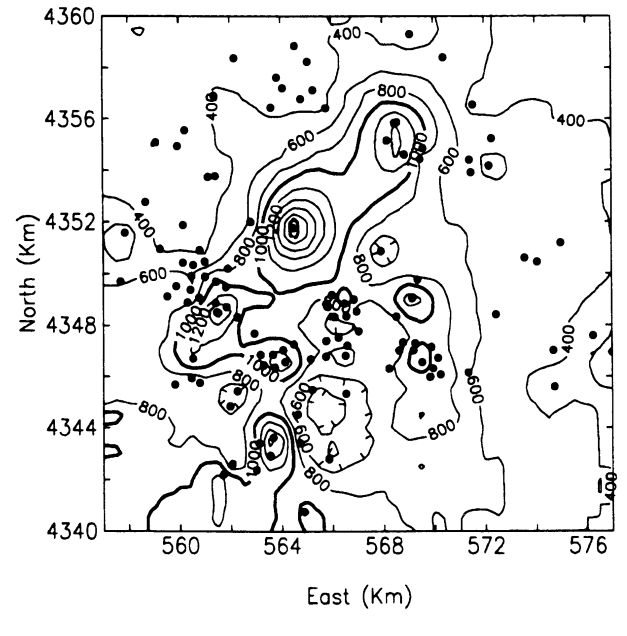

```{r setup, include=FALSE}
knitr::opts_chunk$set(echo = TRUE)

```

***Inicialización de librerias***

```{r require.libs, include=FALSE}
if(!require(pacman)) install.packages("pacman")
pacman::p_load(
    'automap',
    'dplyr',
    'geoR',
    'ggplot2',
    'ggpubr',
    'gstat',
    'spdep',
    'sp',
    'automap',
    'rgdal',
    'udunit2'
)

load(file = "./data/spain_geodata_temperature_1989_spring.RData")

```

Para este trabajo tenemos un grupo grande de librerias a utilizar. Vamos a separar por su
funcionalidad.

```{r init, warning=FALSE, message=FALSE}
## librerias básicas
library(dplyr)
library(ggplot2)
library(ggpubr)
library(readr)
library(reshape2)

## Librerias de geo estadística
library(automap)
library(geoR)
library(gstat)
library(raster)
library(rgdal)
library(sp)
library(spdep)


## Librerias auxiliares
library(automap)
library(FNN)
library(lattice)
library(udunits2)
library(viridis)

```


```{r, child='content/seccion_1.Rmd'}
```

\newpage
```{r, child='content/seccion_2.Rmd'}
```

\newpage
```{r, child='content/seccion_3_variogramas.Rmd'}
```

\newpage
```{r, child='content/seccion_4_krigging.Rmd'}
```

\newpage
# Cuestionario

> Explique por qué es necesario desarrollar herramientas estadísticas específicas para el análisis de datos espaciales y
> por qué la estadística clásica presenta limitaciones para este análisis. Proporcione un ejemplo (no dado en clase) que
> ilustre su explicación.

La estadística clásica presenta limitaciones para analizar datos espaciales por varias 
razones. El motivo más importante es que en ciertas circunstancias, la ubicación de los 
datos nos puede estar queriendo indicar correlaciones y tendencias que con los métodos de
la estadística clásica no se llegan a tomar en cuenta.

Por otro lado, como para estudiar la relación espacial entre los eventos nos interesa 
analizar la autocorrelación espacial entre los mismos. Como los valores de la variable 
suelen estar autocorrelacionados por naturaleza, no podemos asumir que los eventos son 
i.i.d, por lo cual analizarlo con elementos de estadística clásica se complica.

Además, esta rama de la estadística tuvo un importante impacto en el área de Geología, la
cual a su vez contribuyó en la industria minera y de petroleo y gas. Gracias al desarrollo
de técnicas especificas que permiten explotar la condición de los datos georeferenciados.

En la imagen podemos ver un ejemplo extraido de [Geostatistics and petroleum geology, Hohn M](https://zyxy.cug.edu.cn/Geostatistics-and-Petroleum-Geology-Hohn.pdf)
en el cual podemos ver un ejemplo claro del uso de métodos de interpolación geoestadísticos
como el krigging universal para poder generar en base a los datos conocidos (la ubicación
de los pozos petroleros) un mapa de potencial inicial y así ayudar al equipo de campo a
buscar el punto de acceso ideal para penetrar nuevos pozos.

```{r, echo = F, fig.align='center', fig.cap='Mapa de contorno de datos interpolados por kriging de potenciales de pozos petroleros. Los pozos actuales se marcan con un circulo', out.width='140%'}

```

> ¿Cómo se selecciona (elige) el semivariograma teórico? ¿A partir de qué elementos y cómo se evalúa su elección?

Sabiendo que necesitamos que el variograma sea una función condicionalmente definida no 
negativa y que necesitamos
asegurarnos de que la función sea contínua para realizar predicciones, es que ajustamos un
variograma teórico a nuestro
variograma empírico. Realizamos esto con alguna función dada que ya sabemos cumple la
condición de ser definida no
negativa. 

Si bien sabemos que algunas distribuciones teóricas se ajustan mejor a algunos procesos en
particular (lineal para procesos no estacionarios, esférico para procesos con dominios en
$R_{i}$ = 1, 2, 3, etc), la mejor manera de seleccionar el variograma teórico que mejor 
ajuste a nuestros datos es graficar el variograma empírico e ir buscando la función que
mejor se acomode a la forma de los mismos, ya sea con *eyefit* o probando una por una. 

A la hora de realizar este proceso, tenemos algunos parámetros del variograma como lo son
la meseta, el rango práctico y
el *nugget*. La meseta nos dice el punto para el cual aunque la distancia aumente, la
varianza del cambio no se modifica; el rango práctico indica cuando estoy a 5% de llegar
a la meseta; y, finalmente, el *nugget* aparece implícito en algunos procesos y define el
tramo entre el comienzo donde empiezo a medir y puede que no tenga datos, y donde 
encuentro efectivamente el primer dato. Estos parámetros podemos definirlos observando el
variograma empírico. 

Una vez que seleccionamos varias opciones que nos parece se asemejen a nuestro variograma
empírico, podemos evaluar la *performance* de las mismas por distintos métodos: MCO, MC
Ponderado y Gaussiano con la Función de Máxima Verosimilitud.
Nos interesa quedarnos con el variograma teórico que menor error tenga con respecto a los
datos empíricos, ya que ese será el que mejor ajuste tenga. 
